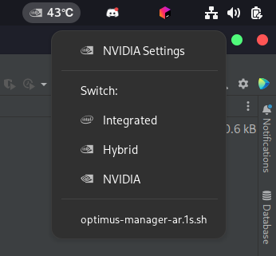

# Argos Script For Optimus-Manager

Gnome Shell Indicator for Optimus-Manager, using Argos API.<br><br>
<center></center>

___

### Requirements
- [Argos](https://extensions.gnome.org/extension/1176/argos/)
    * Currently outdated: last commit `7 months ago`. Argos will be install automatically along with a GNOME Shell v42 patch. 

- [Optimus-Manager](https://github.com/Askannz/optimus-manager) Awesome Optimus Switch script!
- Zenity for dialog window By @ArionWT


### Installation
Clone the repository and navigate into it:
  ```bash
  git clone https://github.com/inzar98/optimus-manager-argos.git
  cd optimus-manager-argos
  ```
Make install:
  ```bash
  make install
  ```
If you have any `file exists` issues, simply use `-i` before `install`
___

### Uninstall
Uninstall the Argos script. Will not uninstall Argos itself.
```bash
# Remove the files
make uninstall
```
---
Special Thanks to Cyberalex4 and Askannz <3! 

Revived by [@xzntrc](https://github.com/xzntrc)
